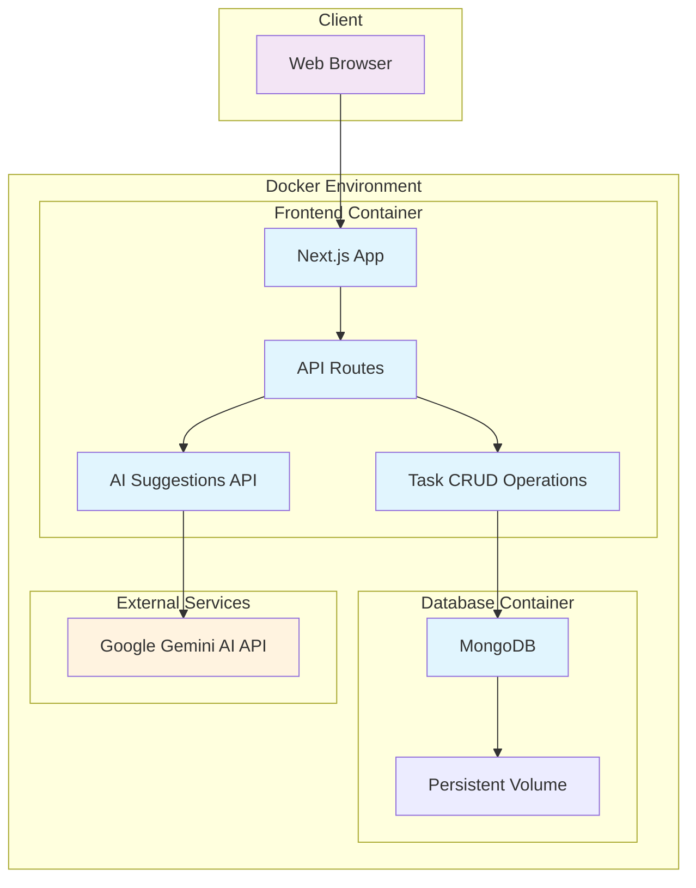

# Task Manager Application

A comprehensive task management application built with Next.js 15, TypeScript, and Tailwind CSS, featuring full CRUD operations, modern UI, and Docker deployment.

## Architecture

This application follows a microservices architecture with containerized services:



**Services:**

- **Next.js Application Container**: Frontend UI + API routes for task management
- **MongoDB Container**: Database with persistent volume storage
- **Google Gemini AI**: External service for intelligent task suggestions

## Features

✨ **Core Features:**

- Create, read, update, and delete tasks
- Mark tasks as completed/pending
- Set due dates and categories
- Rich task descriptions
- Beautiful, responsive UI with Tailwind CSS

🤖 **AI-Powered:**

- Intelligent task categorization
- Smart due date suggestions
- Powered by Google Gemini API

🔍 **Advanced Filtering & Search:**

- Full-text search across titles, descriptions, and categories
- Filter by category, status (completed/pending/overdue)
- Sort by creation date, due date, or title
- Real-time filtering with instant results

📊 **Analytics Dashboard:**

- Task completion statistics
- Category breakdown
- Overdue and upcoming task alerts
- Visual progress indicators

⚡ **Bulk Operations:**

- Select multiple tasks
- Bulk mark as completed/pending
- Bulk delete operations
- Quick select all functionality

## Tech Stack

- **Frontend:** Next.js 15, React 19, TypeScript
- **Styling:** Tailwind CSS 4
- **Database:** MongoDB with Mongoose ODM
- **AI:** Google Gemini API
- **Package Manager:** pnpm
- **Icons:** Lucide React
- **Notifications:** React Hot Toast

## Prerequisites

Before running this application, make sure you have:

- Node.js (v18 or higher)
- pnpm (v8 or higher)
- MongoDB (local installation or MongoDB Atlas)
- Google Gemini API key

## Installation

1. **Clone the repository:**

   ```bash
   git clone <your-repo-url>
   cd task-manager
   ```

2. **Install dependencies using pnpm:**

   ```bash
   pnpm install
   ```

3. **Set up environment variables:**

   Create a `.env.local` file in the root directory:

   ```env
   MONGODB_URI=mongodb://localhost:27017/mytodoapp
   GOOGLE_GEMINI_API=your_google_gemini_api_key_here
   ```

4. **Start MongoDB:**

   If using local MongoDB:

   ```bash
   # macOS with Homebrew
   brew services start mongodb-community

   # Or using Docker Compose (included in project)
   docker-compose up -d mongo
   ```

5. **Run the development server:**

   ```bash
   pnpm dev
   ```

   The application will be available at `http://localhost:3000`.

## Docker Support

The project includes comprehensive Docker support for easy deployment:

### Quick Start with Docker Compose

```bash
# Start the entire application with MongoDB
docker-compose up

# Or build and run just the app
docker build -t task-manager .
docker run -p 3000:3000 task-manager
```

### Manual Docker Commands (Assignment Requirement)

For detailed manual Docker setup without Docker Compose, see [MANUAL_DOCKER_COMMANDS.md](./MANUAL_DOCKER_COMMANDS.md)

### Docker Hub Images

The application images are available on Docker Hub:

- **Application**: `yourusername/task-manager-app:v1`
- **Database**: Uses official `mongo:7.0` image

To use the pre-built images:

```bash
# Create network and volume
docker network create app-network
docker volume create mongo-data

# Run MongoDB
docker run -d --name mongo --network app-network -v mongo-data:/data/db -p 27017:27017 mongo:7.0

# Run the application
docker run -d --name app --network app-network -p 3000:3000 \
  -e MONGODB_URI=mongodb://mongo:27017/mytodoapp \
  -e GOOGLE_GEMINI_API=your_api_key_here \
  yourusername/task-manager-app:v1
```

### Building and Pushing to Docker Hub

```bash
# Build the image
docker build -t task-manager-app .

# Tag for Docker Hub
docker tag task-manager-app yourusername/task-manager-app:v1

# Login to Docker Hub
docker login

# Push to Docker Hub
docker push yourusername/task-manager-app:v1
```

## API Endpoints

### Tasks

- `GET /api/todos` - Get all tasks
- `POST /api/todos` - Create a new task
- `GET /api/todos/[id]` - Get a specific task
- `PUT /api/todos/[id]` - Update a task
- `DELETE /api/todos/[id]` - Delete a task

### Search & Filter

- `GET /api/todos/search?q=query&category=cat&status=pending` - Search tasks

### Statistics & Bulk Operations

- `GET /api/todos/stats` - Get task statistics
- `POST /api/todos/stats` - Perform bulk operations

### AI Suggestions

- `POST /api/ai-suggest` - Get AI-powered category and due date suggestions

## Project Structure

```
src/
├── app/
│   ├── api/
│   │   ├── todos/
│   │   │   ├── route.ts
│   │   │   ├── [id]/route.ts
│   │   │   ├── bulk/route.ts
│   │   │   ├── export/route.ts
│   │   │   ├── search/route.ts
│   │   │   └── stats/route.ts
│   │   └── ai-suggest/route.ts
│   ├── globals.css
│   ├── layout.tsx
│   └── page.tsx
├── components/
│   ├── AddTodoForm.tsx
│   ├── BulkActions.tsx
│   ├── Dashboard.tsx
│   ├── FilterBar.tsx
│   ├── TodoItem.tsx
│   └── TodoList.tsx
├── lib/
│   └── mongodb.ts
└── models/
    └── Todo.ts
```

## Environment Variables

| Variable            | Description                           | Required |
| ------------------- | ------------------------------------- | -------- |
| `MONGODB_URI`       | MongoDB connection string             | Yes      |
| `GOOGLE_GEMINI_API` | Google Gemini API key for AI features | Yes      |

## Getting Google Gemini API Key

1. Go to [Google AI Studio](https://aistudio.google.com/app/apikey)
2. Create a new API key
3. Copy the key to your `.env.local` file

## MongoDB Setup

### Local MongoDB

```bash
# Install MongoDB (macOS)
brew tap mongodb/brew
brew install mongodb-community

# Start MongoDB
brew services start mongodb-community
```

### MongoDB Atlas (Cloud)

1. Create account at [MongoDB Atlas](https://www.mongodb.com/cloud/atlas)
2. Create a new cluster
3. Get connection string and update `MONGODB_URI`

## Development Scripts

```bash
# Start development server
pnpm dev

# Build for production
pnpm build

# Start production server
pnpm start

# Run linting
pnpm lint

# Type checking
pnpm type-check
```

## Contributing

1. Fork the repository
2. Create a feature branch: `git checkout -b feature-name`
3. Make your changes
4. Commit your changes: `git commit -m 'Add feature'`
5. Push to the branch: `git push origin feature-name`
6. Submit a pull request

## Troubleshooting

### Common Issues

1. **MongoDB Connection Error:**

   - Ensure MongoDB is running
   - Check connection string in `.env.local`
   - Verify network access for MongoDB Atlas

2. **AI Suggestions Not Working:**

   - Verify Google Gemini API key
   - Check API key permissions
   - Ensure sufficient API quota

3. **Build Errors:**
   - Clear pnpm cache: `pnpm store prune`
   - Delete `node_modules` and reinstall: `rm -rf node_modules && pnpm install`

## License

This project is licensed under the MIT License - see the LICENSE file for details.

## Support

If you encounter any issues or have questions, please create an issue in the GitHub repository.
