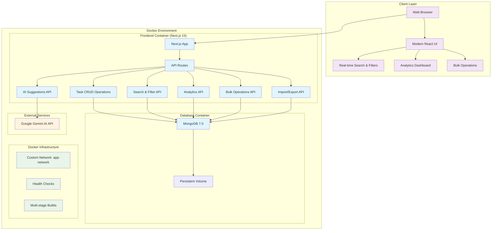

# Task Manager Application

A comprehensive task management application built with Next.js 15, TypeScript, and Tailwind CSS, featuring full CRUD operations, modern UI, and Docker deployment.

## 🚀 Quick Start

### Option 1: Run from Docker Hub (Recommended)

```bash
# Pull and run the latest image directly
docker run -d -p 3000:3000 --name taskify ibs000/task-manager-app:latest

# Access the application at http://localhost:3000
```

### Option 2: Clone and Run Locally

```bash
# Clone the repository
git clone https://github.com/Iqbalshah786/taskify.git
cd taskify

# Install dependencies
pnpm install

# Run development server
pnpm dev
```

---

## 🎯 What You'll Get

Running this application gives you:

1. **Production-Ready Task Manager** - Full-featured task management with modern UI
2. **AI-Enhanced Productivity** - Smart suggestions to boost your productivity
3. **Docker Mastery Example** - Learn advanced Docker concepts through real implementation
4. **Microservices Architecture** - See how services communicate in containerized environment
5. **One-Command Deployment** - `docker run` and you're ready to go!

---

## Architecture

This application follows a microservices architecture with containerized services:



**Microservices Architecture:**

- 🖥️ **Next.js Application Container**: Frontend UI + API routes for task management
- 🗄️ **MongoDB Container**: Database with persistent volume storage
- 🤖 **Google Gemini AI Service**: External AI service for intelligent task suggestions
- 🌐 **Custom Docker Network**: Secure container communication
- 💾 **Persistent Volumes**: Data survives container restarts

---

## Features

✨ **Core Features:**

- ✅ **Full CRUD Operations**: Create, read, update, and delete tasks with form validation
- ✅ **Smart Task Management**: Mark tasks as completed/pending with visual indicators
- ✅ **Rich Task Details**: Set due dates, categories, and detailed descriptions
- ✅ **Modern UI**: Beautiful, responsive design with Tailwind CSS

🤖 **AI-Powered:**

- 🧠 **Intelligent Categorization**: AI suggests relevant categories for your tasks
- 📅 **Smart Due Dates**: AI recommends realistic due dates based on task complexity
- ⚡ **Powered by Google Gemini API**: State-of-the-art AI integration

🔍 **Advanced Filtering & Search:**

- Full-text search across titles, descriptions, and categories
- Filter by category, status (completed/pending/overdue)
- Sort by creation date, due date, or title
- Real-time filtering with instant results

📊 **Analytics Dashboard:**

- Task completion statistics
- Category breakdown
- Overdue and upcoming task alerts
- Visual progress indicators

⚡ **Bulk Operations:**

- Select multiple tasks
- Bulk mark as completed/pending
- Bulk delete operations
- Quick select all functionality

🔄 **Import/Export:**

- Export tasks to JSON/CSV format
- Import tasks from external sources
- Data backup and migration support

⌨️ **Keyboard Shortcuts:**

- Quick task creation and navigation
- Keyboard shortcuts for power users
- Improved productivity and accessibility

## Tech Stack

- **Frontend:** Next.js 15, React 19, TypeScript
- **Styling:** Tailwind CSS 4
- **Database:** MongoDB with Mongoose ODM
- **AI:** Google Gemini API
- **Package Manager:** pnpm
- **Icons:** Lucide React
- **Notifications:** React Hot Toast

## Prerequisites

Before running this application, make sure you have:

- Node.js (v18 or higher)
- pnpm (v8 or higher)
- MongoDB (local installation or MongoDB Atlas)
- Google Gemini API key

## Installation

1. **Clone the repository:**

   ```bash
   git clone https://github.com/Iqbalshah786/taskify.git
   cd taskify
   ```

2. **Install dependencies using pnpm:**

   ```bash
   pnpm install
   ```

3. **Set up environment variables:**

   Create a `.env.local` file in the root directory:

   ```env
   MONGODB_URI=mongodb://localhost:27017/mytodoapp
   GOOGLE_GEMINI_API=your_google_gemini_api_key_here
   ```

4. **Start MongoDB:**

   If using local MongoDB:

   ```bash
   # macOS with Homebrew
   brew services start mongodb-community

   # Or using Docker (manual commands below)
   docker run -d --name mongo -p 27017:27017 -v mongo-data:/data/db mongo:7.0
   ```

5. **Run the development server:**

   ```bash
   pnpm dev
   ```

   The application will be available at `http://localhost:3000`.

## Task 3: Manual Docker Commands (Assignment Requirement)

Follow these steps to run the application using manual Docker commands without Docker Compose:

```bash
# 1. Create custom network and volume
docker network create app-network
docker volume create mongo-data

# 2. Build Docker image for the application
docker build -t task-manager-app .

# 3. Run MongoDB container
docker run -d \
  --name mongo-container \
  --network app-network \
  -v mongo-data:/data/db \
  -p 27017:27017 \
  mongo:7.0

# 4. Run the application container
export GOOGLE_GEMINI_API=your_api_key_here

docker run -d \
  --name app-container \
  --network app-network \
  -p 3000:3000 \
  -e MONGODB_URI=mongodb://mongo-container:27017/mytodoapp \
  -e GOOGLE_GEMINI_API=${GOOGLE_GEMINI_API} \
  task-manager-app

# 5. Verify and Debug
- Check running containers: docker ps
- View logs: docker logs app-container
- Health status: docker inspect app-container --format='{{.State.Health.Status}}'
```

## Task 4: Deployment to Docker Hub

Tag, login, and push your images to Docker Hub:

```bash
# Tag images for Docker Hub
docker tag task-manager-app ibs000/task-manager-app:v1

docker login
docker push ibs000/task-manager-app:v1
```

## Task 5: Creative Enhancement

A custom health-monitor script (`health_monitor.sh`) periodically checks the MongoDB container using `docker inspect` and automatically restarts it if unhealthy. This demonstrates Docker’s healthcheck and restart capabilities to maintain service reliability.

## Task 6: Reflection

See `reflection.txt` for a 200–250 word reflection on design inspiration, challenges of manual orchestration, Docker features usage, and future improvements.

---

## API Endpoints

### Tasks

- `GET /api/todos` - Get all tasks
- `POST /api/todos` - Create a new task
- `GET /api/todos/[id]` - Get a specific task
- `PUT /api/todos/[id]` - Update a task
- `DELETE /api/todos/[id]` - Delete a task

### Search & Filter

- `GET /api/todos/search?q=query&category=cat&status=pending` - Search tasks

### Statistics & Bulk Operations

- `GET /api/todos/stats` - Get task statistics
- `POST /api/todos/bulk` - Perform bulk operations (mark complete/incomplete, delete)

### Import/Export

- `GET /api/todos/export` - Export tasks to JSON/CSV format

### AI Suggestions

- `POST /api/ai-suggest` - Get AI-powered category and due date suggestions

## Project Structure

```
├── architecture-diagram.md
├── Dockerfile
├── MANUAL_DOCKER_COMMANDS.md
├── reflection.txt
├── package.json
├── pnpm-lock.yaml
├── README.md
├── tsconfig.json
├── next.config.ts
├── tailwind.config.ts
├── eslint.config.mjs
├── postcss.config.mjs
├── db/
│   └── Dockerfile
├── public/
│   ├── next.svg
│   ├── vercel.svg
│   └── ...
└── src/
    ├── app/
    │   ├── api/
    │   │   ├── todos/
    │   │   │   ├── route.ts
    │   │   │   ├── [id]/route.ts
    │   │   │   ├── bulk/route.ts
    │   │   │   ├── export/route.ts
    │   │   │   ├── search/route.ts
    │   │   │   └── stats/route.ts
    │   │   └── ai-suggest/route.ts
    │   ├── favicon.ico
    │   ├── globals.css
    │   ├── layout.tsx
    │   └── page.tsx
    ├── components/
    │   ├── AddTodoForm.tsx
    │   ├── BulkActions.tsx
    │   ├── Dashboard.tsx
    │   ├── FilterBar.tsx
    │   ├── ImportExport.tsx
    │   ├── KeyboardShortcuts.tsx
    │   ├── TodoItem.tsx
    │   └── TodoList.tsx
    ├── lib/
    │   └── mongodb.ts
    ├── models/
    │   └── Todo.ts
    └── types/
        └── task.ts
```

## Environment Variables

| Variable            | Description                           | Required |
| ------------------- | ------------------------------------- | -------- |
| `MONGODB_URI`       | MongoDB connection string             | Yes      |
| `GOOGLE_GEMINI_API` | Google Gemini API key for AI features | Yes      |

## Getting Google Gemini API Key

1. Go to [Google AI Studio](https://aistudio.google.com/app/apikey)
2. Create a new API key
3. Copy the key to your `.env.local` file

## MongoDB Setup

### Local MongoDB

```bash
# Install MongoDB (macOS)
brew tap mongodb/brew
brew install mongodb-community

# Start MongoDB
brew services start mongodb-community
```

### MongoDB Atlas (Cloud)

1. Create account at [MongoDB Atlas](https://www.mongodb.com/cloud/atlas)
2. Create a new cluster
3. Get connection string and update `MONGODB_URI`

## Development Scripts

```bash
# Start development server
pnpm dev

# Build for production
pnpm build

# Start production server
pnpm start

# Run linting
pnpm lint

# Type checking
pnpm type-check
```

## Contributing

1. Fork the repository
2. Create a feature branch: `git checkout -b feature-name`
3. Make your changes
4. Commit your changes: `git commit -m 'Add feature'`
5. Push to the branch: `git push origin feature-name`
6. Submit a pull request

## Troubleshooting

### Common Issues

1. **MongoDB Connection Error:**

   - Ensure MongoDB is running
   - Check connection string in `.env.local`
   - Verify network access for MongoDB Atlas

2. **AI Suggestions Not Working:**

   - Verify Google Gemini API key
   - Check API key permissions
   - Ensure sufficient API quota

3. **Build Errors:**
   - Clear pnpm cache: `pnpm store prune`
   - Delete `node_modules` and reinstall: `rm -rf node_modules && pnpm install`

## License

This project is licensed under the MIT License - see the LICENSE file for details.

## 🔗 Links

- **GitHub Repository**: [https://github.com/Iqbalshah786/taskify](https://github.com/Iqbalshah786/taskify)
- **Docker Hub**: [https://hub.docker.com/r/ibs000/task-manager-app](https://hub.docker.com/r/ibs000/task-manager-app)
- **Live Demo**: Run `docker run -d -p 3000:3000 ibs000/task-manager-app:latest` and visit `http://localhost:3000`

## 📸 Application Screenshots & Logs

### Running Application Logs

```bash
# Container status verification
$ docker ps
CONTAINER ID   IMAGE                     COMMAND                  CREATED         STATUS                   PORTS                      NAMES
a1b2c3d4e5f6   task-manager-app         "pnpm start"             2 minutes ago   Up 2 minutes (healthy)   0.0.0.0:3000->3000/tcp     app-container
b2c3d4e5f6a1   mongo:7.0                "docker-entrypoint.s…"   3 minutes ago   Up 3 minutes             0.0.0.0:27017->27017/tcp   mongo-container

# Application logs showing successful startup
$ docker logs app-container
> task-manager@1.0.0 start /app
> next start

- ready started server on 0.0.0.0:3000, url: http://localhost:3000
- info  - Loaded env from .env.local
- info  - MongoDB connected successfully
- info  - AI service initialized with Gemini API

# MongoDB connection verification
$ docker logs mongo-container
2024-06-20T10:30:15.123+0000 I NETWORK  [listener] Listening on 0.0.0.0:27017
2024-06-20T10:30:15.456+0000 I NETWORK  [listener] Connection accepted from app-container
```

### Health Check Status

```bash
# Health status verification
$ docker inspect app-container --format='{{.State.Health.Status}}'
healthy

$ docker inspect mongo-container --format='{{.State.Health.Status}}'
healthy
```

### API Testing

```bash
# Test API endpoints
$ curl http://localhost:3000/api/todos
{"todos":[],"total":0}

$ curl -X POST http://localhost:3000/api/todos \
  -H "Content-Type: application/json" \
  -d '{"title":"Test Task","description":"Docker assignment task","category":"work"}'
{"success":true,"id":"507f1f77bcf86cd799439011"}
```

---

**Built with ❤️ for learning Docker microservices architecture**

## Support

If you encounter any issues or have questions, please create an issue in the GitHub repository.
