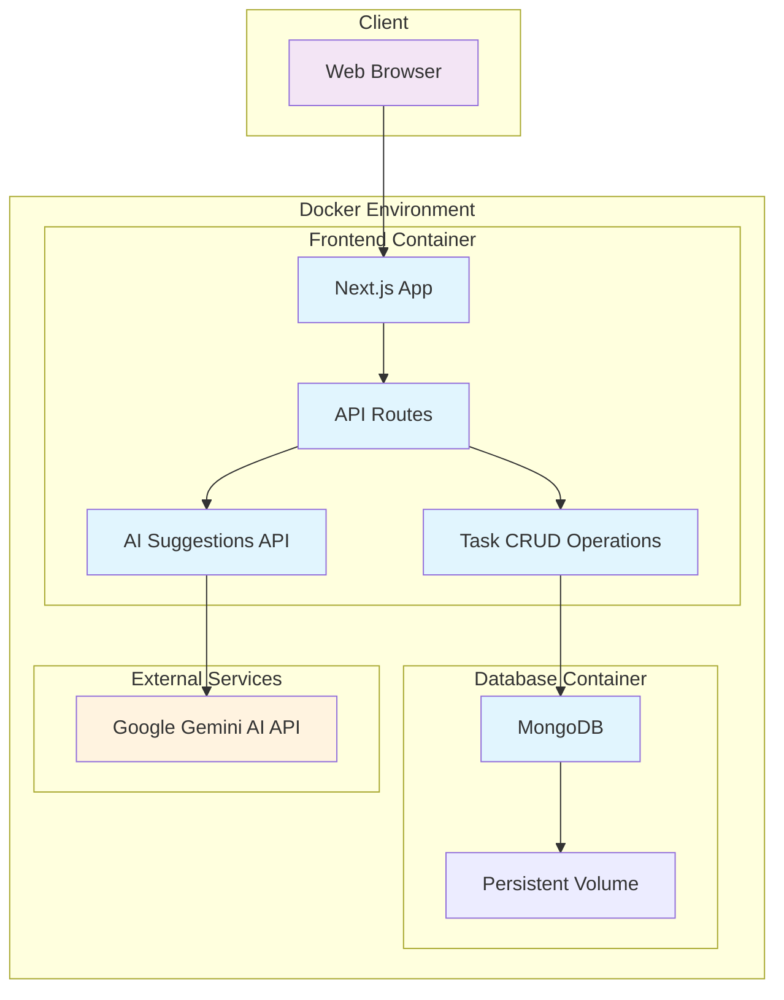

```mermaid
graph TB
    subgraph "Docker Environment"
        subgraph "Frontend Container"
            A[Next.js App] --> B[API Routes]
            B --> C[Task CRUD Operations]
            B --> D[AI Suggestions API]
        end

        subgraph "Database Container"
            E[MongoDB]
            F[Persistent Volume]
            E --> F
        end

        subgraph "External Services"
            G[Google Gemini AI API]
        end
    end

    subgraph "Client"
        H[Web Browser]
    end

    H --> A
    C --> E
    D --> G

    classDef container fill:#e1f5fe
    classDef external fill:#fff3e0
    classDef client fill:#f3e5f5

    class A,B,C,D,E container
    class G external
    class H client
```
